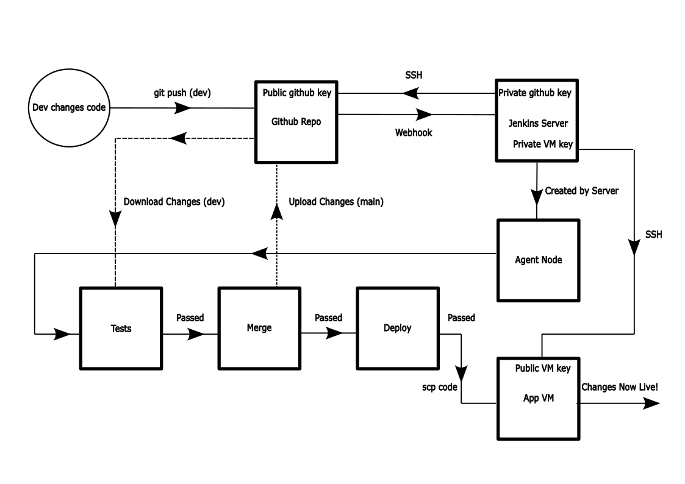
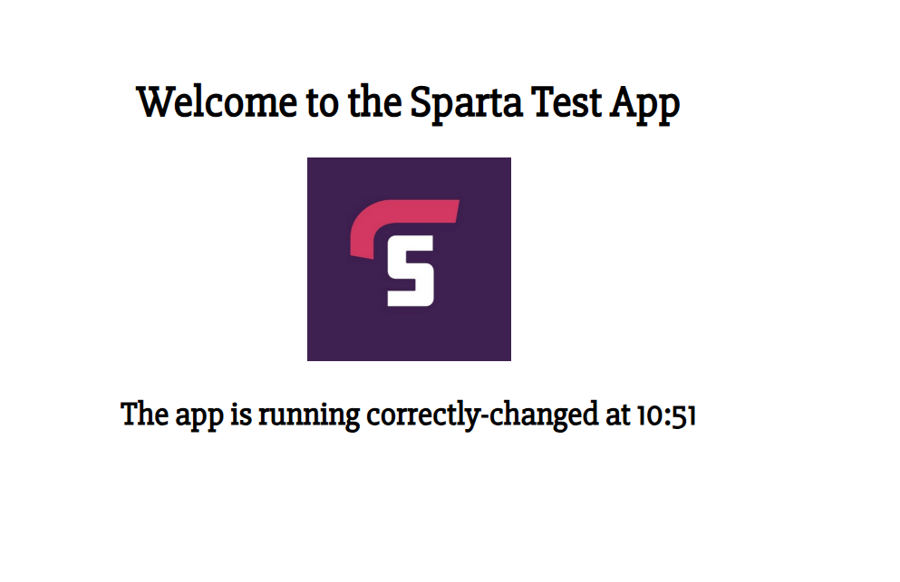
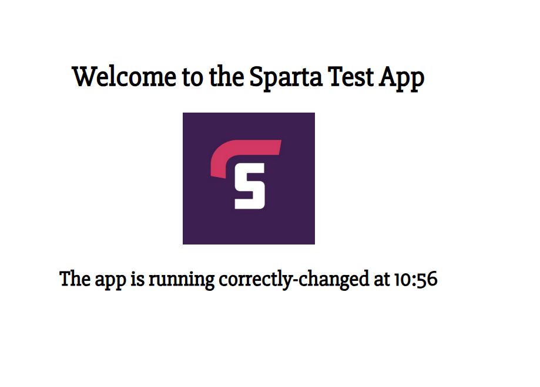

# Setting Up a Basic 3-stage CI/CD Pipeline with Jenkins
 This documents explains how we set up our first automated CI/CD pipeline using the Jenkins web UI

 ## The Basic Set-up and Prerequisites

 Our pipeline will consist of 3 stages, called Jenkins projects:
1. After a change is made to the source code locally, on the dev branch, and pushed to github some automated tests will run (pre-programmed into the source code)
2. If these tests pass, the changes will be merged to the main branch and uploaded to github
   * This requires Jenkins to be able to upload changes to github, for which ssh credentials need to be in place
3. The updated code will be copied to the app VM and the app will be restarted to show the changes
   * This require Jenkis to be able to ssh into the app VM, for for which ssh credentials need to be in place

The process as a whole looks like this



1. A dev makes some changes on the dev branch and pushes to git hub
2. A webhook notifies Jenkins of this push
3. Jenkins creates an agent node to run the tests on (not necessary for small tests)
4. The CI/CD pipeline described above runs on the agent node
5. The changes are now in place and the app is up and running again

### Why do this?
* This automation allows for changes to the code to be rapidly tested, merged and deployed 
* The end user can see this updated and working code in action very quickly (I found the whole pipeline took around 2 minutes)
* THe automation ensures robustness and consistency
  * Bugs in the code will be caught quickly and, crucially, before deployment
  * Automating the process ensures consitency of testing and reduces human error

### Prerequisites

#### Github project 

* This will need 2 branches, main and dev
* Changes will be made locally to the dev branch
* Jenkins will need permission to push to github, using the private ssh key for github account
    1. To create new key pair use ```ssh-keygen -t rsa -b 4096 -C "<your-email-address>"``` and follow the usual steps, using a sensible naming convention
    2. Add public key to repo
       1. Navigate to repo, settings, security, deploy keys
       2. Paste in your new public key
       3. Make sure to allow read/write access with this key
    3. Private key will be added to Jenkins in later steps

#### Jenkins Server

You will need a Jenkins server and login details for the web UI
* Our server was set-up to create agent nodes to actually run the Jenkins projects, but these can be run all on the server if they're small enough
* Default Jenkins port for HTTP traffic is port 8080, so this needs to be built into any networking security rules to access the web UI
* Jenkins linux installation details can be found [here](https://www.jenkins.io/doc/book/installing/linux/) 
* Login details are created when installing Jenkins on the server
* Jenkins will need to ssh into the app VM, so will need the correct private ssh key to allow this

#### App VM

You will also need a VM to actually run the app, which Jenkins will need to access
* Standard app vm will do, I used a terraform project with startup script
  * BLOCKER the startup script started the app as a root user, so my Jenkins project 3 didn't stop it as planned - this led to the code being updated correctly, but the changes weren't reflected as output
  * SOLUTION I ssh'd into the app VM and stopped it using kill (as discussed a few weeks ago), then started it as ubuntu user 
* Jenkins will need to ssh into this machine, so this needs to be allowed in the networking security rules
  * BLOCKER/QUESTION As the Jenkins server creates agent nodes how do we know which IPs to allows ssh access from?
  * NON-IDEAL SOLUTION I allowed ssh access from all - I think static IP addresses for Jenkins nodes would be best

## Stage 1: Run tests after git push

1. On Jenkins web UI click new item, name it and select freestyle
   * N.B. if creating a new project similar to a previous one you can select the bottom option instead
2. Write a short description
3. We used 5 builds to keep for history
4. Check the github project box and enter the HTTPS URL
   * Replace the .git at the end of the URL with a / 
5. Check the git option in SOurce Code Management and add the ssh version of the repositary URL
6. Copy in the private key for the git repo if you haven't added it already and give it an appropriate name, or select the correct key if already added to Jenkins
7. Branch to build should be dev
8. Build trigger should be GitHub hook trigger for GITScm polling - this will make it so that a git push to this repo triggers the start of the project
   1. To set up the webhook so a git push triggers this stage firstly navigate to github repo
   2. Settings, Webhooks, click add webhook
   3. Payload URL is \<jenkins-server-url>/github-webhook/
   4. Click add webhook, make sure push event is the trigger 
9. Build environment should be Provide Node & npm bin/ folder to PATH, make sure to select correct nodejs version - as we need to run node commands
10. For build steps we will use an execute shell to run the commands we need
    * ```
        cd app
        npm install
        npm test
      ```
    * This will run the prebuilt tests

## Stage 2: Merge changes from dev branch to main if stage 1 was successful
1. Create a new project as before
2. Same github details as before
3. Additional Behaviours
   * These can be used as an preferable alternative to running git commands in the execute shell
   * We can use merge before build here
   * Name of repo: origin
   * Branch to merge to: main
   * This won't actually push the changes, but can be done with an additional action (I need to watch the recording again!)
4. Build triggers should be Build after other projects are built
   * Select Trigger only if build is stable
   * Projects to watch should be the one from stage 1
   * This means that if stage 1 is successful stage 2 will start automatically
5. Build environment should be SSH Agent, allowing Jenkins to use the SSH key we uploaded to authenticate git push
6. I needed an execute shell command ```git push origin HEAD:main``` to push the merged changes

## Stage 3: Copy the updated code to the app VM and restart the app
1. For this Jenkins will need the private ssh key for your app VM
   1. Navigate to Manage Jenkins on the web UI
   2. Under credentials click on down arrow next to any global tag and select add credentials
   3. Change Kind to ssh username with private key
   4. Add the details as in Stage 1
2. Add the git details again, but make sure working on main branch now
3. Build trigger should now be project 2 successful
4. SSH settings same as before
5. Execute shell code that I used:
   * ```bash
        scp -o StrictHostKeyChecking=no README.md ubuntu@ec2-108-129-219-125.eu-west-1.compute.amazonaws.com:/home/ubuntu/sparta_test_app-main
        scp -o StrictHostKeyChecking=no -r app/ ubuntu@ec2-108-129-219-125.eu-west-1.compute.amazonaws.com:/home/ubuntu/sparta_test_app-main
        ssh ubuntu@ec2-108-129-219-125.eu-west-1.compute.amazonaws.com << EOF
	        cd ~/sparta_test_app-main/app
	        pm2 stop all
            pm2 start app.js --name sparta-test-app
        EOF
        ```

   * This copies the updated code from main branch to the app VM
     * You may/probably will need to update the IP address of the app VM
   * SSH's into the app VM and restarts the app
     * N.B. This only works if the app was originally started by ubuntu user!
   * The ```<< EOF ....... EOF``` ensures the commands contained within are run in the app VM, as oppose to the Jenkins node

## Results

A change was made at 10:51, app was running at 10:55 (took longer as Jenkins needed to spin up a worker VM)



Second change made at 10:56, app updated at 10:58


